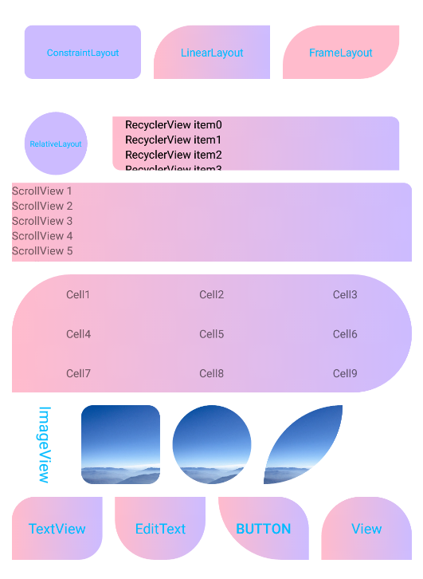

# corner
## 一款圆角渐变效果的控件库，支持各种常用控件

## 支持的ViewGoup
- ConstraintLayout -> CConstraintLayout
- LinearLayout -> CLinearLayout
- FrameLayout -> CFrameLayout
- RelativeLayout -> CRelativeLayout
- RecyclerView ->CRecyclerView
- ScrollView -> CScrollView
- TableLayout -> CTableLayout

## 支持的View
- TextView -> CTextView
- ImageView -> CImageView
- EditText -> CEditText
- Button -> CButton
- View -> CView

## 用法
### Step 1. Add the JitPack repository to your build file

    allprojects {
            repositories {
                ...
                maven { url 'https://jitpack.io' }
            }
        }
### Step 2. Add the dependency

	dependencies {
	        implementation 'com.github.itchenning:corner:1.0.0Beta'
	}

### Step 3. 在xml中加入:

	   <com.itchenning.corner.widget.viewgroup.CFrameLayout
	        android:layout_width="match_parent"
	        android:layout_height="100dp"
	        android:layout_margin="16dp"
	        app:corner_bg_color="#CCBBFF"
	        app:corner_end_color="#CCCCFF"
	        app:corner_gradient_direction="horizontal"
	        app:corner_left_bottom_radius="10dp"
	        app:corner_left_top_radius="10dp"
	        app:corner_radius="10dp"
	        app:corner_right_bottom_radius="10dp"
	        app:corner_right_top_radius="10dp"
	        app:corner_start_color="#FFFFCC" />

## 属性说明
|属性名       				|描述    	     					|默认值			    |
| :------------ 			| :-------------					| :---------:	    |
|corner_bg_color			| 背景颜色(优先选择)					|Color.TRANSPARENT	|
|corner_radius				| 圆角半径(优先选择)					|0					|
|corner_left_top_radius		| 左上圆角半径						|0					|	
|corner_left_bottom_radius	| 左下圆角半径						|0					|
|corner_right_top_radius	| 右上圆角半径						|0					|
|corner_right_bottom_radius	| 右下圆角半径						|0					|
|corner_start_color			| 渐变开始颜色						|Color.TRANSPARENT	|
|corner_end_color			| 渐变结束颜色						|Color.TRANSPARENT	|
|corner_gradient_direction	| 渐变方向,支持水平、垂直、对角线三种	|horizontal(水平)	|
